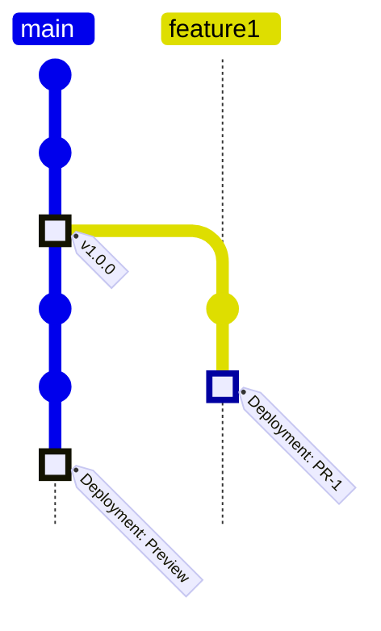

# DitsAndDahs Telegram Bot

Telegram Bot written in Haskell and hosted on AWS Lambda

## Implementation

The API of the Bot is written using the `servant` library. The `servant` API is then run in two different ways and packaged into distinct executables:

- `bootstrap` designed to run on an AWS Lambda with the Amazon Linux runtime using the following libraries:
  - [HAL](https://github.com/Nike-Inc/hal) for integrating with AWS Lambda and AWS API Gateway Proxy Integration
  - [wai-handler-hal](https://github.com/bellroy/wai-handler-hal) for integrating the `servant` API with the `HAL` library
- `main` for running locally using the [warp](https://hackage.haskell.org/package/warp) webserver

## Branching concept

For the branching concept the simple GitHub Flow was adopted. 

The branching concept is closely linked to environments which the bot is automatically deployed to. The head of the main branch is automatically deployed to the [preview version](https://t.me/DitsAndDahsPreviewBot) of the bot.

GitHub releases are automatically deployed to the [live version](https://t.me/DitsAndDahsBot) of the bot upon publishing. In the graphic below the tag `v1.0.0` is the version deployed to the live bot.

For every pull request an ephemeral environment is created for manual integration testing. This environment is updated automatically on every commit made to the pull request and destroyed when the pull request is merge or closed. In the graphic below an ephemeral pull request environment with the name `PR-1` is created for the branch `feature1`.

## Infrastructure

Infrastructure for the Bot is automatically provisioned using Terraform and GitHub Actions Workflows. As mentioned above there are 2 permanent environments, namely `Production` and `Preview` which are connected to Telegrams Bot API.

Ephemeral PR environments are not connected to the Telegram Bot API as it would required a new Bot per PR environment which is hard to achieve as provisioning a Telegram Bot is hardly automatically obtainable. These deployments are also mainly intended for developer testing which does not necessarily require a connection to the Telegram Bot API.
